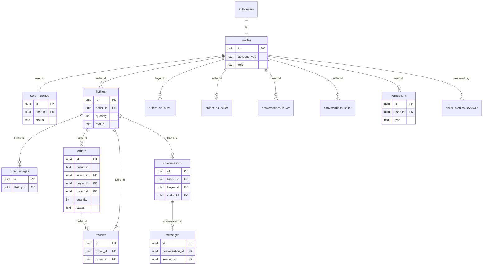
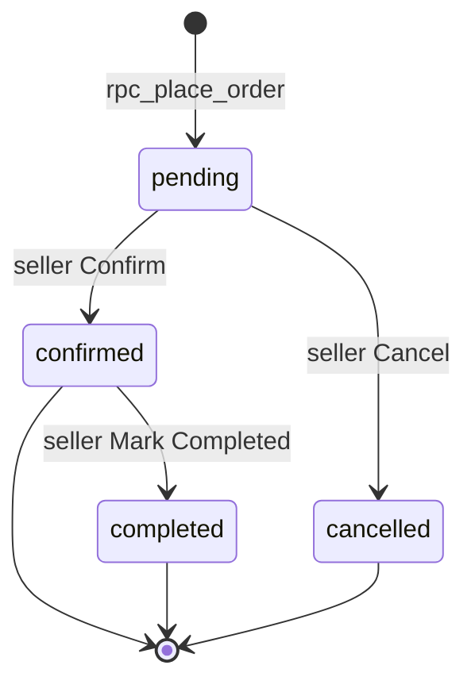

# Motodo.id Supabase Migration Plan

**Branch:** `cursor-homepage-v1`  
**Date:** 6 September 2026  
**Status:** Architecture / documentation only. Supabase is **not** implemented.

**Constraints honored:** no Supabase project, packages, tables, app behavior changes, deletes, rewrites, commit, or push.

**Sources:** TypeScript types and `src/lib/*` stores, `src/data/listings.ts` catalog, `QA_REPORT.md` (Rounds 1–3). Items labeled **Recommendation** are proposed production design, not current behavior.

---

## 1. Executive Summary

Motodo.id is a Vite + React marketplace. All marketplace state lives in the browser:

- **Auth:** `localStorage` user list + session. Login matches email only; **passwords are not stored or verified**.
- **Admin:** `user.email === "admin@motodo.id"` (`src/lib/admin.ts`).
- **Inventory:** listing `quantity` is total stock; pending/confirmed orders reserve units (`src/lib/inventory.ts`). Round 3 QA **PASS** in the mock; it is **not** a production constraint.
- **Money:** IDR integers (`Math.round`). Seller success fee is **2% of `buyerTotal`**, stored on the order, not paid separately by the buyer.
- **Orders:** one listing per order (no order-item array). Seller-only status machine: `pending → confirmed → completed`, or `pending → cancelled`. Admin **views** orders only.
- **Dual catalog:** static `src/data/listings.ts` is merged with `motodo.listings`. Catalog-only sellers produce “Unknown seller” in admin (QA LOW).

**Production target:** Supabase Auth + PostgreSQL + RLS + Storage + Realtime (chat/notifications). The browser must send **intent**; the database/RPC must compute inventory, money, status, eligibility, and admin power.

**READY FOR SUPABASE IMPLEMENTATION: NO.** This document is the blueprint. No project, env, SQL, or client SDK exists yet.

---

## 2. Current Architecture

```
Browser (Vite/React)
  AuthContext → motodo.session + motodo.users
  Feature libs → localStorage JSON arrays + CustomEvents + storage events
  Catalog fallback → src/data/listings.ts (in-memory, not localStorage)
  Images → JPEG data URLs in listing.images[] OR public /listings/*.jpg
```

| Layer | Current | Production target |
| --- | --- | --- |
| UI | React Router, existing pages | Same UI; data source swap |
| Session | `motodo.session` JSON | Supabase Auth session |
| Persistence | localStorage keys below | PostgreSQL + Storage |
| Authorization | client filters (`buyerId === user.id`) | RLS + `auth.uid()` |
| Inventory | client `placeOrder` / `updateSellerOrderStatus` | RPC in a transaction + row lock |
| Realtime | `subscribe*Updates` (same-tab events + `storage`) | Supabase Realtime on chat (and optionally notifications) |
| Payments | mock method + `paymentStatus: pending` | columns now; gateway later |

**No `sessionStorage` usage** exists in the codebase.

### 2.1 Current TypeScript models (as coded)

There is **no separate Profile type**. `AuthUser` is the profile. There is **no Order Item entity**. Delivery and payment are fields on `Order`. Listing images are `string[]`, not a type.

**AuthUser** (`src/types/auth.ts`) — `UserRole = "buyer" | "seller"` (admin is not a role)

| Field | TS | Required | Default | Meaning | Proposed PG |
| --- | --- | --- | --- | --- | --- |
| id | string | yes | `crypto.randomUUID()` / seed ids | User id | `profiles.id` uuid = auth.uid |
| fullName | string | yes | signup input | Display name | `full_name` text |
| email | string | yes | lowercased | Login key | `email` text |
| role | UserRole | yes | signup choice | Buyer vs seller **intent** | `account_type` text |
| phone | string | optional | unset until checkout/profile | Contact | `phone` text null |
| createdAt | string ISO | yes | `now` | Member since | `created_at` timestamptz |
| password | — | UI only | never stored | Login form only | Auth secrets, not public |

**SellerProfile** (`src/types/seller.ts`) — `SellerStatus = pending \| approved \| rejected`

| Field | TS | Required | Default | Meaning | Proposed PG |
| --- | --- | --- | --- | --- | --- |
| id | string | yes | UUID | Application id | `seller_profiles.id` |
| userId | string | yes | AuthUser.id | Owner | `user_id` uuid FK |
| fullName, email, phone | string | yes | form | Applicant snapshot | text |
| businessName, businessType, nib | string | yes | form | Garage / NIB | text + CHECK type |
| yearEstablished | number | yes | form | Year | integer |
| city, showroomAddress, postalCode | string | yes | form | Location | text |
| instagram, website, businessHours | string | optional | omitted | Marketing | text null |
| description | string | yes | form | About | text |
| sellerFleetAvailable | boolean | yes | false | Fleet checkout | boolean |
| status | SellerStatus | yes | pending on create | Verification | text CHECK |
| createdAt | string | yes | now | Applied | timestamptz |
| rejectionReason | string | optional | on reject | Shown to seller | text null |
| reviewedAt | string | optional | on decision | One timestamp for approve or reject | `reviewed_at` |
| reviewedBy | string | optional | admin user id | Who decided | uuid FK null |

**MotorcycleListing** seller (`src/types/sellerListing.ts`) vs catalog view (`src/types/marketplace.ts` with formatted `price` string). Persistence is the seller type.

| Field | TS | Required | Default | Meaning | Proposed PG |
| --- | --- | --- | --- | --- | --- |
| id | string | yes | UUID / seed / catalog id | Listing | uuid (catalog string ids need remap) |
| sellerId | string | yes | AuthUser.id | Owner | `seller_id` uuid |
| name, brand, model | string | yes | form | Title | text |
| category | MotorcycleCategory | yes | form | Browse facet | text CHECK |
| price | number | yes | IDR integer | Unit price | bigint |
| quantity | number | yes | ≥1 on form | **Total stock** | integer |
| condition | ListingCondition \| "" | yes on type | "" | Condition | text null |
| year, mileage | number | yes | form | Specs | integer |
| engine, color, city, location, showroomAddress, description | string | yes | form | Specs / pickup | text |
| transmission, fuel | union \| "" | yes on type | "" | Specs | text null |
| images | string[] | yes | [] max 10 | data URLs or `/listings/*.jpg` | `listing_images` |
| status | draft \| active \| sold | yes | draft | Visibility | text CHECK |
| createdAt, updatedAt | string | yes | now | Audit | timestamptz |

**Order** (`src/types/order.ts`) — one listing per order

| Field | TS | Required | Default | Meaning | Proposed PG |
| --- | --- | --- | --- | --- | --- |
| id | string | yes | `MTD-` + 8 hex | Public order number | `public_id` + uuid PK |
| listingId, sellerId, buyerId | string | yes | from listing + session | Parties | uuid FKs |
| listingName, listingImage | string | name yes; image optional | snapshot | Display | text |
| buyerName, buyerEmail, buyerPhone | string | yes | session + checkout | Snapshot | text |
| unitPrice, quantity, subtotal, discountAmount, buyerTotal | number | yes | computed | IDR / qty | bigint / int |
| discountType, discountValue | optional | unused Coming Soon | — | null |
| sellerSuccessFeeRate | number | yes | `0.02` | Snapshot | numeric |
| sellerSuccessFeeAmount, sellerNetAmount | number | yes | computed | Motodo / seller | bigint |
| deliveryMethod | pickup \| seller_fleet \| third_party | yes | pickup | Method | text CHECK |
| deliveryFee | number | optional | 0 | Always 0 now | bigint default 0 |
| deliveryAddress, deliveryCity, deliveryNotes, deliveryProvider | string | optional | fleet / unused | Delivery | text null |
| paymentMethod | bank_transfer \| discuss_with_seller | yes | bank_transfer | Mock method | text CHECK |
| status | pending \| confirmed \| completed \| cancelled | yes | pending | Machine | text CHECK |
| paymentStatus | pending \| paid \| failed \| refunded | optional | pending | Mock; not tied to status | text default pending |
| inventoryRestored | boolean | optional | true on new orders | Mock legacy deduct flag | **omit** |
| createdAt, updatedAt | string | yes | now | Audit | timestamptz |

**Conversation / ChatMessage** (`src/types/chat.ts`)

| Field | TS | Required | Default | Meaning | Proposed PG |
| --- | --- | --- | --- | --- | --- |
| Conversation.id | string | yes | UUID | Thread | uuid |
| listingId, sellerId, buyerId | string | yes | from listing | Participants | uuid FKs |
| listingName, listingImage | string | name yes | snapshot | Header | text |
| lastMessage, lastMessageAt | string | yes | `""` / now | Inbox preview | text / timestamptz |
| unreadForBuyer, unreadForSeller | number | yes | 0 | Badges | integer ≥0 |
| createdAt | string | yes | now | Start | timestamptz |
| ChatMessage.conversationId, senderId | string | yes | | Ownership | uuid FKs |
| senderRole | buyer \| seller | yes | | Side | text CHECK |
| message | string | yes | trimmed | Body | `body` text |
| createdAt | string | yes | now | Order | timestamptz |
| read | boolean | yes | false | Incoming read | boolean |

**Review** (`src/types/review.ts`)

| Field | TS | Required | Default | Meaning | Proposed PG |
| --- | --- | --- | --- | --- | --- |
| id | string | yes | UUID | Review | uuid |
| orderId | string | yes | | One per order | uuid UNIQUE |
| listingId, sellerId, buyerId | string | yes | copied from order | Denormalized | uuid FKs |
| rating | number | yes | 1–5 int | Stars | integer CHECK |
| title | string | optional | | Headline | text null |
| comment | string | yes | 5–1000 chars | Body | text |
| status | published \| hidden | yes | published | Admin moderation | text CHECK |
| createdAt, updatedAt | string | yes | now | Audit | timestamptz |

**Notification** (`src/types/notification.ts`)

| Field | TS | Required | Default | Meaning | Proposed PG |
| --- | --- | --- | --- | --- | --- |
| id | string | yes | UUID | Row | uuid |
| userId | string | yes | recipient | Inbox owner | uuid FK |
| type | NotificationType union | yes | | Kind | text CHECK |
| title, message | string | yes | | Copy | text |
| relatedId, relatedType | optional | | Deep link | uuid / text |
| read | boolean | yes | false | Bell | boolean |
| createdAt | string | yes | now | Sort | timestamptz |
| unique | CreateNotificationInput only | | Dedup flag, not stored | unique index |

**PublicSellerProfile** is a read model of approved `SellerProfile`. **Catalog MotorcycleListing** is a view model (`price` formatted string, nested `seller`). Do not persist catalog as a second table.

---

## 3. Current Data Inventory

### 3.1 localStorage keys

#### `motodo.users`

| | |
| --- | --- |
| **Purpose** | Registered accounts (and seeded seller/admin users). |
| **Structure** | `AuthUser[]` |
| **Reads** | `src/lib/auth.ts`, admin user list, reviews display names, chat names, `placeOrder` buyer lookup |
| **Writes** | `signup`, `ensureUserExists`, `updateCurrentUser` / `persistNormalized` |
| **Related** | session, seller_profiles.userId, orders.buyerId/sellerId |
| **Security** | Anyone can rewrite users; no password hash; forge any `id` |
| **Supabase** | `auth.users` + `public.profiles` |

#### `motodo.session`

| | |
| --- | --- |
| **Purpose** | Current logged-in user. |
| **Structure** | Single `AuthUser` JSON |
| **Reads** | `getCurrentUser`, `AuthProvider` |
| **Writes** | login, signup, logout, profile update |
| **Related** | all gated routes |
| **Security** | Setting this JSON is “login”; no token, no expiry |
| **Supabase** | Auth session (not a table) |

#### `motodo.sellerProfiles`

| | |
| --- | --- |
| **Purpose** | Seller applications and garage data. |
| **Structure** | `SellerProfile[]` |
| **Reads** | seller dashboard, public store, checkout fleet gate, listings publish gate, admin sellers |
| **Writes** | create/update/resubmit, admin approve/reject, seed |
| **Related** | `profiles.id` (userId), listings.sellerId (= userId), notifications |
| **Security** | Client can self-approve |
| **Supabase** | `seller_profiles` |

#### `motodo.listings`

| | |
| --- | --- |
| **Purpose** | Seller-created listings (quantity = **total** stock). |
| **Structure** | `MotorcycleListing[]` (`src/types/sellerListing.ts`) |
| **Reads** | browse (via catalog map), checkout, seller/admin, inventory |
| **Writes** | CRUD, publish/sold/active, inventory apply/sync, admin status, seed, catalog hydrate |
| **Related** | orders, reviews, chat, images in-array |
| **Security** | Quantity and status writable by anyone with DevTools |
| **Supabase** | `listings` + `listing_images` |

#### `motodo.inventory_reservation_v1`

| | |
| --- | --- |
| **Purpose** | One-time flag: add back quantity previously deducted on pending/confirmed orders. |
| **Structure** | string `"1"` |
| **Reads/Writes** | `migrateDeductedPendingOrdersOntoListingStock` in `listings.ts` |
| **Related** | orders.inventoryRestored |
| **Security** | N/A (dev migration) |
| **Supabase** | **Do not migrate.** Production reservation is derived from order status. |

#### `motodo_orders`

| | |
| --- | --- |
| **Purpose** | Marketplace orders (single listing line). |
| **Structure** | `Order[]` |
| **Reads** | buyer/seller/admin order UIs, inventory reservation, reviews eligibility, platform revenue |
| **Writes** | `placeOrder`, `updateSellerOrderStatus`, listings migration |
| **Related** | listings, profiles, reviews, notifications |
| **Security** | Forge orders, skip fee, skip reservation |
| **Supabase** | `orders` |

#### `motodo_conversations`

| | |
| --- | --- |
| **Purpose** | Listing-scoped buyer↔seller threads. |
| **Structure** | `Conversation[]` |
| **Reads** | messages UIs, unread badges, notification links |
| **Writes** | create/start, send, mark read |
| **Related** | messages, listings, profiles |
| **Security** | Unrelated conversation IDs readable if you parse storage |
| **Supabase** | `conversations` |

#### `motodo_chat_messages`

| | |
| --- | --- |
| **Purpose** | Chat messages. |
| **Structure** | `ChatMessage[]` |
| **Reads** | thread UI |
| **Writes** | send, mark read |
| **Related** | conversations |
| **Security** | Same as conversations |
| **Supabase** | `messages` |

#### `motodo_reviews`

| | |
| --- | --- |
| **Purpose** | Order reviews. |
| **Structure** | `Review[]` |
| **Reads** | listing/seller/public pages, admin, rating aggregates |
| **Writes** | `createReview`, admin hide/publish |
| **Related** | orders (1:1), listings, sellers, buyers |
| **Security** | Eligibility only in JS |
| **Supabase** | `reviews` |

#### `motodo_notifications`

| | |
| --- | --- |
| **Purpose** | In-app notifications. |
| **Structure** | `Notification[]` |
| **Reads** | bell, notifications page (filtered by `userId` in JS) |
| **Writes** | create on events; mark read/unread |
| **Related** | conversation, order, listing, seller, review |
| **Security** | Insert any type for any userId |
| **Supabase** | `notifications` (created by triggers/RPC, not the browser for critical events) |

### 3.2 In-memory / hardcoded (not localStorage)

| Store | Purpose | Security / destination |
| --- | --- | --- |
| `src/data/listings.ts` | Browse catalog + featured; IDs like `sportster-1200`; synthetic `sellerId` from garage name | Dual inventory; catalog-only “Unknown seller”. **Recommendation:** seed into `listings` owned by real `seller_profiles`, or retire from production browse. |
| `src/data/categories.ts` | Browse category cards | **Recommendation:** keep as frontend enum matching listing `category` CHECK; no table. |
| `MOCK_ADMIN_EMAIL` / `MOCK_ADMIN_USER_ID` | Admin gate + admin notifications | **Must not** remain email-based. `profiles.role = admin` + JWT claim. |
| `SEEDED_SELLERS` | Dewi, Raka, Sinta, Maya, Andi | Dev seed SQL, not client seed. |
| Seed listings `seed-listing-bandung-*` | Dewi T100 / draft / sold | Dev seed SQL. |
| `SELLER_SUCCESS_FEE_RATE = 0.02` | Fee | Store **rate snapshot on order**; config table optional later. |
| `/listings/*.jpg` | Static public assets | Keep for seeds; seller photos → Storage. |
| Favorites (`SavedPage`) | “Coming soon” — **no store** | Out of Phase 1 schema. |

### 3.3 Custom events (same-tab live)

`motodo:listings-updated`, `motodo:orders-updated`, `motodo:sellers-updated`, `motodo:chat-updated`, `motodo:notifications-updated`, `motodo:reviews-updated`. Replaced by query invalidation + Realtime.

---

## 4. Proposed Architecture

**Recommendation** (not current):

- **Vite/React stays.** Swap `src/lib/*` storage functions for Supabase client + RPC.
- **`auth.users`** is identity. **`profiles`** is Motodo profile (`full_name`, `phone`, `account_type` buyer/seller intent).
- **`seller_profiles`** is the garage + verification (`pending` / `approved` / `rejected`). A user may browse as a buyer while seller status is pending.
- **Admin** is `profiles.role = 'admin'` (and JWT `app_role`), never email.
- **Checkout** is `rpc_place_order`. **Seller status** is `rpc_update_order_status`.
- **Listing images** in Storage; `listing_images` holds paths.
- **Chat** uses Realtime on `messages`.
- **Critical notifications** from DB triggers after committed state changes.
- **No Edge gateway** until a later payments phase. Keep `payment_status` on `orders`.

**Tables not proposed (unnecessary for current product):** `order_items` (one listing per order), `payments`, `deliveries`, `seller_fees`, `categories`, `brands`, `addresses`, `conversation_participants`, `audit_logs` (defer), `favorites`.

---

## 5. Database Schema

All PKs `uuid` unless noted. Timestamps `timestamptz`. Money **IDR whole rupiah** as `bigint` CHECK `>= 0`.

### 5.1 `profiles`

Maps `AuthUser`. **No password column.**

| Column | PG type | Null | Default | Unique | FK |
| --- | --- | --- | --- | --- | --- |
| id | uuid | no | = `auth.users.id` | PK | `auth.users(id)` ON DELETE CASCADE |
| full_name | text | no | | | |
| email | text | no | | yes | synced from auth |
| phone | text | yes | | | |
| account_type | text | no | `'buyer'` | | CHECK `buyer\|seller` |
| role | text | no | `'user'` | | CHECK `user\|admin` |
| created_at | timestamptz | no | `now()` | | |
| updated_at | timestamptz | no | `now()` | | |

**Indexes:** `email`.  
**Notes:** Current `AuthUser.role` is buyer/seller **intent**. Admin is a separate `role`. Seeded admin today has `AuthUser.role: "buyer"` plus email check — do not copy that.

### 5.2 `seller_profiles`

| Column | PG type | Null | Default | Unique | FK |
| --- | --- | --- | --- | --- | --- |
| id | uuid | no | `gen_random_uuid()` | PK | |
| user_id | uuid | no | | yes (1:1) | `profiles(id)` |
| full_name | text | no | | | snapshot of applicant |
| email | text | no | | | |
| phone | text | no | | | |
| business_name | text | no | | | |
| business_type | text | no | | | CHECK current `BUSINESS_TYPES` |
| nib | text | no | | | |
| year_established | integer | no | | | |
| city | text | no | | | |
| showroom_address | text | no | | | |
| postal_code | text | no | | | |
| instagram | text | yes | | | |
| website | text | yes | | | |
| description | text | no | | | |
| business_hours | text | yes | | | |
| seller_fleet_available | boolean | no | `false` | | |
| status | text | no | `'pending'` | | CHECK `pending\|approved\|rejected` |
| rejection_reason | text | yes | | | |
| reviewed_at | timestamptz | yes | | | maps current `reviewedAt` |
| reviewed_by | uuid | yes | | | `profiles(id)` admin |
| created_at | timestamptz | no | `now()` | | |
| updated_at | timestamptz | no | `now()` | | |

**Do not invent** separate `approved_at` / `rejected_at` unless desired later; current model uses one `reviewedAt`/`reviewedBy` pair.

**Indexes:** `status`, `user_id`.

### 5.3 `listings`

Maps seller `MotorcycleListing`. `quantity` = **total stock**.

| Column | PG type | Null | Default | Unique | FK |
| --- | --- | --- | --- | --- | --- |
| id | uuid | no | `gen_random_uuid()` | PK | |
| seller_id | uuid | no | | | `profiles(id)` (same as current `sellerId` = user id) |
| name | text | no | | | |
| brand | text | no | `''` | | |
| model | text | no | | | |
| category | text | no | | | CHECK `MOTORCYCLE_CATEGORIES` |
| price | bigint | no | | | CHECK `> 0` |
| quantity | integer | no | | | CHECK `>= 0` |
| condition | text | yes | | | CHECK listing conditions or empty |
| year | integer | no | | | |
| mileage | integer | no | | | CHECK `>= 0` |
| engine | text | no | | | |
| transmission | text | yes | | | |
| fuel | text | yes | | | |
| color | text | no | | | |
| city | text | no | | | |
| location | text | no | | | |
| showroom_address | text | no | | | |
| description | text | no | | | |
| status | text | no | `'draft'` | | CHECK `draft\|active\|sold` |
| created_at | timestamptz | no | `now()` | | |
| updated_at | timestamptz | no | `now()` | | |

**Indexes:** `(seller_id, status)`, `(status)` where public, `(category)`.  
**CHECK:** optional `status = 'draft' OR quantity` rules via trigger; sold when available = 0 is **computed**, not only status.  
**Reserved quantity:** **not stored.** `sum(orders.quantity) WHERE listing_id AND status IN ('pending','confirmed')`.

### 5.4 `listing_images`

Splits `listing.images: string[]`.

| Column | PG type | Null | Default | Unique | FK |
| --- | --- | --- | --- | --- | --- |
| id | uuid | no | `gen_random_uuid()` | PK | |
| listing_id | uuid | no | | | `listings(id)` ON DELETE CASCADE |
| storage_path | text | no | | | |
| sort_order | integer | no | `0` | | |
| created_at | timestamptz | no | `now()` | | |

**Unique:** `(listing_id, sort_order)`. **Max 10** images: trigger or CHECK via count (trigger). Cover = `sort_order = 0`.

### 5.5 `orders`

Current `Order` is **not** a cart. Keep quantity on the order. Display id `MTD-XXXXXXXX` as `public_id`.

| Column | PG type | Null | Default | Unique | FK |
| --- | --- | --- | --- | --- | --- |
| id | uuid | no | `gen_random_uuid()` | PK | |
| public_id | text | no | | yes | e.g. `MTD-` + 8 hex |
| listing_id | uuid | no | | | `listings(id)` |
| seller_id | uuid | no | | | `profiles(id)` denormalized, must match listing.seller_id |
| buyer_id | uuid | no | | | `profiles(id)` |
| listing_name | text | no | | | snapshot |
| listing_image_path | text | yes | | | snapshot |
| buyer_name | text | no | | | snapshot |
| buyer_email | text | no | | | |
| buyer_phone | text | no | | | |
| unit_price | bigint | no | | | snapshot of listing.price |
| quantity | integer | no | | | CHECK `>= 1` |
| subtotal | bigint | no | | | |
| discount_type | text | yes | | | unused (Coming Soon) |
| discount_value | numeric | yes | | | unused |
| discount_amount | bigint | no | `0` | | currently always 0 |
| buyer_total | bigint | no | | | |
| seller_success_fee_rate | numeric(6,4) | no | | | snapshot e.g. `0.0200` |
| seller_success_fee_amount | bigint | no | | | |
| seller_net_amount | bigint | no | | | |
| delivery_method | text | no | | | CHECK `pickup\|seller_fleet\|third_party` |
| delivery_fee | bigint | no | `0` | | currently 0 |
| delivery_address | text | yes | | | fleet |
| delivery_city | text | yes | | | fleet |
| delivery_notes | text | yes | | | |
| delivery_provider | text | yes | | | unused |
| payment_method | text | no | | | CHECK `bank_transfer\|discuss_with_seller` |
| status | text | no | `'pending'` | | CHECK order statuses |
| payment_status | text | no | `'pending'` | | CHECK payment statuses |
| created_at | timestamptz | no | `now()` | | |
| updated_at | timestamptz | no | `now()` | | |

**Do not persist** `inventoryRestored` (mock-only).  
**Indexes:** `buyer_id`, `seller_id`, `listing_id`, `status`, `(listing_id, status)`.  
**CHECK:** `buyer_id <> seller_id`; `buyer_total = subtotal - discount_amount`; `seller_net_amount = buyer_total - seller_success_fee_amount`; `third_party` **rejected** at RPC until product enables it.

### 5.6 `conversations`

| Column | PG type | Null | Default | Unique | FK |
| --- | --- | --- | --- | --- | --- |
| id | uuid | no | `gen_random_uuid()` | PK | |
| listing_id | uuid | no | | | `listings(id)` |
| seller_id | uuid | no | | | `profiles(id)` |
| buyer_id | uuid | no | | | `profiles(id)` |
| listing_name | text | no | | | snapshot |
| listing_image_path | text | yes | | | |
| last_message | text | no | `''` | | |
| last_message_at | timestamptz | no | `now()` | | |
| unread_for_buyer | integer | no | `0` | | CHECK `>= 0` |
| unread_for_seller | integer | no | `0` | | CHECK `>= 0` |
| created_at | timestamptz | no | `now()` | | |

**Unique:** `(listing_id, buyer_id, seller_id)` — matches `findConversation`.  
**CHECK:** `buyer_id <> seller_id`.

### 5.7 `messages`

| Column | PG type | Null | Default | Unique | FK |
| --- | --- | --- | --- | --- | --- |
| id | uuid | no | `gen_random_uuid()` | PK | |
| conversation_id | uuid | no | | | `conversations(id)` ON DELETE CASCADE |
| sender_id | uuid | no | | | `profiles(id)` |
| sender_role | text | no | | | CHECK `buyer\|seller` |
| body | text | no | | | maps `message` |
| created_at | timestamptz | no | `now()` | | |
| read | boolean | no | `false` | | |

**Indexes:** `(conversation_id, created_at)`.

### 5.8 `reviews`

| Column | PG type | Null | Default | Unique | FK |
| --- | --- | --- | --- | --- | --- |
| id | uuid | no | `gen_random_uuid()` | PK | |
| order_id | uuid | no | | **yes** | `orders(id)` |
| listing_id | uuid | no | | | `listings(id)` |
| seller_id | uuid | no | | | `profiles(id)` |
| buyer_id | uuid | no | | | `profiles(id)` |
| rating | integer | no | | | CHECK `1..5` |
| title | text | yes | | | |
| comment | text | no | | | length 5–1000 |
| status | text | no | `'published'` | | CHECK `published\|hidden` |
| created_at | timestamptz | no | `now()` | | |
| updated_at | timestamptz | no | `now()` | | |

**Enforcement:** trigger: order.status must be `completed`; `buyer_id`/`listing_id`/`seller_id` match order.

### 5.9 `notifications`

| Column | PG type | Null | Default | Unique | FK |
| --- | --- | --- | --- | --- | --- |
| id | uuid | no | `gen_random_uuid()` | PK | |
| user_id | uuid | no | | | `profiles(id)` |
| type | text | no | | | CHECK current `NotificationType` |
| title | text | no | | | |
| message | text | no | | | |
| related_id | uuid | yes | | | polymorphic |
| related_type | text | yes | | | CHECK related types |
| read | boolean | no | `false` | | |
| created_at | timestamptz | no | `now()` | | |

**Unique (partial):** `(user_id, type, related_id, title)` WHERE `related_id IS NOT NULL` — matches mock `unique: true`.

### 5.10 Evaluated and omitted

| Candidate | Decision |
| --- | --- |
| `order_items` | Omit. Current order is one listing + quantity. |
| `payments` | Omit until a gateway. Use `orders.payment_method` + `payment_status`. |
| `deliveries` | Omit. Delivery columns on `orders`. |
| `seller_fees` | Omit. Snapshot columns on `orders`. |
| `listing_categories` / `brands` | Omit. CHECK + frontend constants. |
| `addresses` | Omit. Fleet address fields on order; showroom on seller/listing. |
| `conversation_participants` | Omit. Exactly two ids on `conversations`. |
| `audit_logs` | **Recommendation:** Phase J optional, not required to match current app. |

---

## 6. Entity Relationships



Current graph: **buyer** and **seller** are both `profiles`. Seller garage is optional `seller_profiles`. **Order item** does not exist as an entity. **Delivery** and **payment** are attributes of `orders`.

---

## 7. Authentication

### Current behavior

- Signup: email unique, stores `AuthUser`, **does not persist password**, sets session, `account` role buyer or seller.
- Login: find user by email; **password ignored** if the account exists; delay ~650ms.
- Logout: remove `motodo.session`.
- Session: survives refresh until logout.
- `LoginPage` if already authenticated → `/`. Query `?next=` is **unused** (QA LOW).
- Google sign-in: “available soon”.

### Target mapping

| Mock | Supabase |
| --- | --- |
| `AuthUser.id` | `auth.users.id` = `profiles.id` |
| `fullName`, `phone`, `account_type` | `profiles` |
| password | Auth hashed credentials |
| session JSON | Auth JWT + refresh token |
| `ensureDevAdminUser` | seed admin in SQL, not client |

### Flows (**Recommendation**)

1. **Signup:** `signUp({ email, password })` → trigger `on_auth_user_created` inserts `profiles` (`full_name`, `account_type` from metadata). Do not auto-insert `seller_profiles`.
2. **Login:** `signInWithPassword`. Honor `?next=` only for same-origin paths (**fix QA LOW** in Auth phase).
3. **Logout:** `signOut`.
4. **Session:** Supabase persist session (localStorage internally is OK; app must not treat it as a user table).
5. **Seller path:** after signup as seller, existing `/seller/register` creates `seller_profiles` pending.

---

## 8. Roles & Authorization

### Current

| Concept | Implementation |
| --- | --- |
| Buyer / seller intent | `AuthUser.role` |
| Can sell | `seller_profiles.status === 'approved'` (`ApprovedSellerRoute`) |
| Admin | **email** `admin@motodo.id` (`isAdmin`) |
| Admin user row | `role: "buyer"` + special email |

### Recommendation (safest practical)

Use **both**:

1. **`profiles.role`:** `user` | `admin` — source of truth in Postgres.
2. **JWT custom claim `app_role`:** set in `custom_access_token_hook` (or Auth Hook) from `profiles.role` so RLS can use `auth.jwt() ->> 'app_role'` without a profiles join on every policy.

**Do not** use email to identify admin.  
**Do not** put admin only in the React bundle.  
**`account_type`** (buyer/seller) is product intent, not privilege. An approved seller is still `profiles.role = user` plus `seller_profiles.status = approved`.

Seller A vs seller B: RLS `seller_id = auth.uid()`. Notifications `user_id = auth.uid()`.

---

## 9. Seller Approval

### Current statuses

`pending` → `approved` or `rejected`. Rejected may **resubmit** to `pending` (`resubmitSellerProfile`). Approve no-ops if already approved. Reject no-ops if same status + same reason.

Fields: `reviewedAt`, `reviewedBy`, `rejectionReason`. No separate approved/rejected timestamps.

### Notifications (current)

| Event | Recipient | Type | Unique |
| --- | --- | --- | --- |
| Apply / resubmit | `mock-admin-motodo` | `seller_registration` “New Seller Registration” | yes |
| Approve | `profile.userId` | title “Seller application approved” | yes |
| Reject | `profile.userId` | title “Seller application rejected” (+ reason) | yes |

Viewing admin pages does not notify (Round 3).

### Production

- `seller_profiles.status` + `reviewed_at` / `reviewed_by` / `rejection_reason`.
- **Only admins** UPDATE status (RLS).
- **Triggers** insert notifications on `INSERT` pending (to admins) and on status transition to approved/rejected (to `user_id`). Match unique key so retries do not duplicate.
- Public store: `getPublicSellerProfile` requires **approved** only.

---

## 10. Inventory & Reservation

### Current (Round 3, mock)

```
total     = listings.quantity
reserved  = SUM(order.quantity) WHERE status IN (pending, confirmed)
available = max(0, total - reserved)
draft     → available 0 for purchase
```

- **placeOrder:** no decrement of `quantity`; `inventoryRestored: true`; validate available; reject if reserved would exceed total.
- **cancel pending:** reservation released (status cancelled). Restore via `applyListingInventoryChange` **only if** `!inventoryRestored` (legacy).
- **confirm:** still reserved; **no** quantity change.
- **complete:** if `inventoryRestored`, `quantity -= sold` **once**; then reserved drops because status is completed. Result: original 10, sold 3 → quantity 7, reserved 0, available 7.
- **sold:** listing `status = sold` when available ≤ 0 (`syncListingAvailability`).
- Buyer UI shows **available**, not reserved.

### Production — must not trust the browser

**Recommendation:** `rpc_place_order` and `rpc_update_order_status` as `SECURITY DEFINER` with lock + checks. Client sends `{ listing_id, quantity, delivery_*, payment_method, contact fields }`.

```
BEGIN
  SELECT * FROM listings WHERE id = $listing FOR UPDATE
  -- also lock seller_profiles row if needed for fleet flag
  reserved := SUM(quantity) FROM orders
              WHERE listing_id = $listing AND status IN ('pending','confirmed')
  available := GREATEST(0, listings.quantity - reserved)
  IF listing.status = 'draft' OR seller not approved OR available < requested THEN ROLLBACK
  IF delivery_method = 'third_party' THEN ROLLBACK  -- Coming Soon
  IF delivery_method = 'seller_fleet' AND NOT seller_fleet_available THEN ROLLBACK
  Compute unit_price FROM listings.price  -- ignore client price
  Compute subtotal, discount=0, buyer_total, fee from current rate, net
  INSERT order status='pending', payment_status='pending', snapshots
  UPDATE listings.status to sold if (quantity - reserved - requested) = 0
COMMIT
```

**Oversell:** row lock + available check + CHECK `quantity >= 0`.  
**Negative inventory:** CHECK on `listings.quantity`; complete uses `quantity = quantity - order.quantity` only when `quantity >= order.quantity`.  
**Duplicate reservation:** one order row; reservation = sum of open statuses only.  
**Duplicate checkout:** **Recommendation:** optional `Idempotency-Key` header stored uniquely; plus disable double-submit in UI (already have placing overlay).  
**Double complete:** `UPDATE orders SET status='completed' WHERE id=$id AND status='confirmed' RETURNING *` — 0 rows = reject.  
**Double cancel:** `WHERE status='pending'`.  
**Do not** decrement `quantity` on place or confirm. Decrement **only** on transition to `completed`.

Sync listing sold/active inside the same transaction after every order insert/status change.

---

## 11. Order State Machine

**Existing only** (`ALLOWED_TRANSITIONS` in `orders.ts`):



No buyer cancel. No admin status change. No confirmed → cancelled. No completed → anything.

| Transition | Who | DB condition | Inventory | Notifications (current copy) |
| --- | --- | --- | --- | --- |
| → pending | buyer (`auth.uid()` = buyer) | listing purchasable | reserve qty | seller `new_order` |
| pending → confirmed | seller (`auth.uid()` = seller_id) | `status = pending` | still reserved | buyer `order_confirmed` |
| pending → cancelled | seller | `status = pending` | release reserve | buyer `order_cancelled` |
| confirmed → completed | seller | `status = confirmed`; total stock ≥ qty | deduct `listings.quantity`; reserve ends | buyer `order_completed` + `review_reminder` |

`payment_status` is **not** tied to these transitions today (QA LOW). **Recommendation:** leave `pending` until a payments phase; do not fake `paid` on complete.

---

## 12. Seller Success Fee

**Existing:** `SELLER_SUCCESS_FEE_RATE = 0.02`.

```
subtotal = round(unitPrice * quantity)
discountAmount = 0 (Coming Soon)
buyerTotal = subtotal - discount
sellerSuccessFeeAmount = round(buyerTotal * 0.02)
sellerNetAmount = buyerTotal - fee
```

Buyer does not pay the fee as a separate line. Revenue dashboards count **confirmed + completed**.

**Recommendation:** persist `seller_success_fee_rate`, `seller_success_fee_amount`, `seller_net_amount` on the order at insert (and never recompute historically from a global constant). Optional later `platform_settings.fee_rate` for **new** orders only. No `seller_fees` table required.

---

## 13. Payments

**Current:** methods `bank_transfer` | `discuss_with_seller`. Copy: “Payment processing will be available in a future release.” `paymentStatus` defaults to `pending`. Type also allows `paid` | `failed` | `refunded` but checkout never sets them. Completed/cancelled orders still show payment pending (QA LOW).

**Recommendation (architecture only, no Xendit):**

- Keep fields on `orders`.
- Meaningful statuses for Motodo’s actual flow: **`pending`** (default), **`paid`**, **`failed`**, **`refunded`** (already on the type — use when a gateway exists).
- Do not auto-mark paid on confirm/complete until money movement exists.
- Future `payments` table only when a provider needs multiple attempts per order.

---

## 14. Delivery

**Current options**

1. **Pickup** — default; showroom from listing/seller; fee N/A / 0.
2. **Seller Fleet** — only if `sellerFleetAvailable`; requires address + city.
3. **Third-party** — UI Coming Soon; `placeOrder` throws if selected.

**Recommendation:** columns on `orders` as specified. RPC rejects `third_party`. RPC rejects fleet unless `seller_profiles.seller_fleet_available`. No deliveries table. Seller can update `seller_fleet_available` on their profile (current `updateSellerProfile`).

---

## 15. Chat & Realtime

**Current:** one conversation per `(listingId, buyerId, sellerId)`. Buyer starts with fixed first message. Cannot chat with self. Unread counters on conversation + `read` on messages. `new_message` notifications are **not** unique (every send notifies).

**Recommendation:**

- Tables `conversations` + `messages` as above.
- Realtime: subscribe to `messages` INSERT filtered by conversation ids the user participates in.
- RLS: `auth.uid() IN (buyer_id, seller_id)`.
- Sender must match role (buyer row only if `sender_id = buyer_id`).
- Unread: keep counters updated by trigger on insert/mark-read to match current UI.

---

## 16. Reviews

**Current rules** (`createReview`): logged in; order exists; `order.buyerId === buyer`; `status === completed`; one review per order; rating 1–5; comment 5–1000 chars. Admin can `hidden` / `published`. Public aggregates use published only. “Verified Purchase” is implied by completed-order origin.

**Production:** UNIQUE `order_id`; trigger validates completed + ids match; RLS insert only `buyer_id = auth.uid()`; seller cannot insert; admin update `status` only.

---

## 17. Notifications

| Type | When (current) | Production creator |
| --- | --- | --- |
| `seller_registration` | apply → admin; approve/reject → seller | **Trigger** on `seller_profiles` |
| `new_order` | placeOrder | **Trigger** on orders INSERT |
| `order_confirmed` / `completed` / `cancelled` | seller status update | **Trigger** on orders status change |
| `review_reminder` | on complete | **Trigger** with completed |
| `new_message` | each send | **Trigger** on messages INSERT |
| `listing_sold` | active → sold via inventory | **Trigger** on listings status |
| `listing_low_inventory` | available crosses to ≤ 2 | **Trigger** after inventory change (compare old/new available) |
| `listing_status` | seller publish/draft (not sold) | **Trigger** on listings status (non-sold) |

**Recommendation:** browser may INSERT nothing except `read` updates. Unique index prevents duplicate decision/order alerts. Fix later: stale `listing_sold` when stock returns (QA LOW) via trigger that does not re-fire uniquely, or a dedicated unsold event — **not in current app**.

---

## 18. Storage

**Current:** `fileToStoredImage` → JPEG data URL, max 10, max edge 1280. Catalog uses `/listings/*.jpg`.

**Recommendation (do not create bucket in this phase):**

- Bucket `listing-images`, **public read** (marketplace photos are public today).
- Path: `{seller_id}/{listing_id}/{uuid}.jpg`.
- Upload/delete: authenticated seller, `listing.seller_id = auth.uid()`, or admin.
- Anonymous: read only.
- Reject data URLs in Postgres; store `storage_path` only.

---

## 19. RLS Strategy

Policies described in prose. **No SQL in this phase.**

Legend: Y = allow matching own rows / published rules. N = deny. A = admin (`app_role = admin`). S = approved seller owner. B = buyer self.

| Table | Anon SELECT | Anon I/U/D | Buyer SELECT | Buyer I | Buyer U | Buyer D | Seller SELECT | Seller I | Seller U | Seller D | Admin |
| --- | --- | --- | --- | --- | --- | --- | --- | --- | --- | --- | --- |
| profiles | N (or limited public name later) | N | own | N (trigger) | own name/phone | N | own | N | own | N | all |
| seller_profiles | **approved only** (public store) | N | approved public; own always | own insert pending | own if not breaking status (no self-approve) | N | same | same | profile fields; **not** status | N | all + status |
| listings | **active** + available>0 + seller approved | N | same public + own if seller | N | N | N | own all statuses | own | own (not stock cheat: quantity via RPC rules) | own drafts? current allows delete | all; status active/draft as today |
| listing_images | if listing public | N | if listing public | N | N | N | own listing | own | own | own | all |
| orders | N | N | `buyer_id = uid` | **via RPC only** | N | N | `seller_id = uid` | N | **via RPC status only** | N | SELECT all; no status update (match current) |
| conversations | N | N | participant | start via RPC | unread | N | participant | N | unread | N | SELECT |
| messages | N | N | participant | if participant | mark read incoming | N | same | same | same | N | SELECT |
| reviews | **published** | N | published + own | completed own order via RPC | N | N | published on own listings | N | N | N | all + hide/publish |
| notifications | N | N | `user_id = uid` | N | `read` only | N | same | N | `read` | N | own + maybe all SELECT |

**Public listings:** align `getPublicListings`: `status = active`, seller approved, available > 0 (available from reserved sum). Draft never public. Sold detail may still be readable today via stored listing (`getPublicListingById` returns sold stored listings) — **preserve that** if detail URLs must work after sell-out.

**Quantity updates:** sellers currently can edit `quantity` in the listing form (total stock). **Recommendation:** allow seller UPDATE quantity but RPC/trigger must forbid `quantity < reserved`. Admin listing activate requires available ≥ 1 (current).

---

## 20. Security Risks

| Risk | Impact | Supabase mitigation |
| --- | --- | --- |
| Client-side authentication; password unused | Anyone with an email in `motodo.users` or a forged session is that user | Auth passwords + verified session; no app-writable user id |
| Admin = email string | Any user can set email to `admin@motodo.id` | `profiles.role` + JWT claim; RLS |
| Client inventory | Oversell, negative stock, skip reservation | `FOR UPDATE` + RPC; CHECK |
| Client order create | Fake totals, 0% fee, buy others’ listings, self-buy | Server computes money; CHECK buyer ≠ seller |
| Client seller approval | Self-approve, skip NIB | Admin-only status column |
| Client fee calculation | Underpay Motodo | Snapshot computed in RPC |
| Client notifications | Spam, spoof approval | Triggers; no client INSERT |
| Client review eligibility | Fake verified purchase | UNIQUE + trigger on completed order |
| Direct localStorage edit | Full marketplace rewrite | Data not in the browser |
| Catalog/listings dual write | Inconsistent stock | Single `listings` table |
| Image data URLs in JSON | Quota, XSS-ish payload size | Storage paths |
| Chat access only in JS | Read all threads in storage | RLS participants |
| `inventoryRestored` flag | Double restore/deduct if wrong | Derived from status only |

---

## 21. localStorage Migration

| Current | Table | Transformation | Concern |
| --- | --- | --- | --- |
| `motodo.users` | `auth.users` + `profiles` | Recreate accounts; **passwords unknown** — users must reset/signup | Cannot silently import passwords |
| `motodo.session` | — | Discard | |
| `motodo.sellerProfiles` | `seller_profiles` | Map fields; `user_id` must match new auth ids | Seed ids vs UUID remap |
| `motodo.listings` | `listings` + `listing_images` | quantity = total; data URLs → Storage upload | Large payloads; fail if quota |
| `motodo.inventory_reservation_v1` | — | Drop | |
| `motodo_orders` | `orders` | Map `id` → `public_id`; new uuid PK; drop `inventoryRestored`; recompute fee if corrupt | Status vs quantity consistency |
| `motodo_conversations` | `conversations` | Direct map | Unread counters |
| `motodo_chat_messages` | `messages` | `message` → `body` | |
| `motodo_reviews` | `reviews` | Direct; enforce unique order | Orphans if order missing |
| `motodo_notifications` | `notifications` | Direct | Dedup unique key |
| `src/data/listings.ts` | optional seed listings | Assign real seller_ids | Catalog-only unknown seller |

**Safe frontend strategy during development (Recommendation):**

1. Keep mock libs behind a **`VITE_DATA_SOURCE=mock|supabase`** flag (implementation phase — not now).
2. Do not delete localStorage adapters until RLS QA passes.
3. Use a **dev Supabase project** with seed SQL matching Dewi/T100, never production.
4. Import mock JSON only into local/dev; never into prod.
5. Feature-flag routes so checkout uses RPC while browse still mock **only** in intermediate phases if needed — prefer vertical slices (Phase roadmap) over long dual-write.

---

## 22. Implementation Roadmap

### PHASE A — Project plumbing

- **Changes:** Supabase project, env vars, types. **Still no app behavior** until B.  
- **Deps:** none. **Risk:** leaking keys. **Test:** env present in local only. **Rollback:** remove env; app unchanged.

### PHASE B — Auth + profiles

- Signup/login/logout/session; `?next=`; drop mock password hole.  
- **Deps:** A. **Risk:** lock out seeded testers. **Test:** signup, refresh, logout. **Rollback:** flag back to mock auth.

### PHASE C — Seller profiles + approval

- Register, resubmit, admin approve/reject, notifications via trigger.  
- **Deps:** B. **Risk:** public leak of pending sellers. **Test:** Round 3 TEST 6–8. **Rollback:** mock seller store.

### PHASE D — Listings + Storage images

- CRUD, publish gates, public list = active + approved + available. Retire catalog dual-read when seeds exist.  
- **Deps:** C. **Risk:** broken images. **Test:** create listing, 10 photos, public/hide. **Rollback:** localStorage listings.

### PHASE E — Inventory + order RPC

- `rpc_place_order`, reservation, sold sync.  
- **Deps:** D. **Risk:** oversell under concurrency. **Test:** Round 3 TEST 1–5 with two clients. **Rollback:** mock orders.

### PHASE F — Checkout + payment abstraction

- Wire checkout UI to RPC; keep mock payment_status pending.  
- **Deps:** E. **Risk:** last-unit race (QA Round 1 overlay). **Test:** last unit + placing state. **Rollback:** mock `placeOrder`.

### PHASE G — Chat + Realtime

- Conversations/messages RLS + Realtime.  
- **Deps:** B, D. **Risk:** message leak. **Test:** two users, unread, no third-party access. **Rollback:** mock chat.

### PHASE H — Reviews

- Unique completed-order reviews; admin hide.  
- **Deps:** E. **Test:** one per order; incomplete order rejected. **Rollback:** mock reviews.

### PHASE I — Notifications

- Triggers for all types; client mark-read only.  
- **Deps:** C, E, G, H. **Test:** no dupes on reload. **Rollback:** mock notifications.

### PHASE J — Admin + RLS hardening

- Replace email admin; admin listings/users/reviews; policy review.  
- **Deps:** B–I. **Test:** buyer cannot `/admin`; seller A cannot seller B. **Rollback:** keep mock admin only in local.

### PHASE K — Production QA

- Repeat QA_REPORT Round 1–3 against Supabase; add concurrency tests; CI E2E.  
- **Deps:** J. **Risk:** catalog leftovers. **Rollback:** delay cutover.

---

## 23. Testing Strategy

- Reuse **QA_REPORT.md** Round 3 TEST 1–9 as the inventory/notification acceptance set — against RPC, two browsers.
- Auth: password required; forged `localStorage` session ignored.
- RLS: seller A / seller B / buyer / anon / admin matrices (section 19).
- Concurrency: two `rpc_place_order` for last units.
- Order machine: illegal transitions return error; no double complete.
- Reviews: unique violation on second insert.
- Chat: Realtime message appears; outsider SELECT empty.
- Do not claim production PASS until Phase K. Mock Round 3 PASS is **not** server proof.

---

## 24. Rollback Strategy

- **Per phase:** `VITE_DATA_SOURCE=mock` restores current libs (when that flag is introduced in implementation).
- **Database:** do not drop localStorage on users’ browsers; mock data remains until they clear it.
- **Auth:** if Auth is on, rollback to mock session is a **product** flag, not a data merge.
- **Never** dual-write inventory in production (split brain).
- Failed RPC: transaction rollback; listing row unlocked; no partial order.

---

## 25. Final Recommendations

1. Implement **nothing** until Phase A is explicitly scheduled. This file is the contract.
2. **Never trust the browser** for: available stock, reservation, totals, fee, net, status transitions, review eligibility, seller approval, admin.
3. **Browser sends:** listing id, quantity, delivery choice + fleet address, payment method, contact phone, chat text, review rating/comment, listing content, seller application fields, notification read flags.
4. **Server/DB computes:** price snapshot, money, fee rate snapshot, inventory, listing sold/active, order public_id, notification rows, review listing/seller ids.
5. Keep **one listing per order**; skip `order_items` until a cart exists.
6. Keep delivery/payment **on the order** until a PSP exists.
7. Replace **email admin** in the first Auth/admin slice, not last.
8. Treat **`src/data/listings.ts` as non-production inventory**; seed or drop it so admin never sees Unknown seller.
9. Do not migrate `inventoryRestored` or `motodo.inventory_reservation_v1`.
10. Plan password reset for any imported mock users — mock passwords were never stored.

---

### Production data principles (browser vs server)

| Must never trust from browser | Browser may send |
| --- | --- |
| Available / reserved / total after ops | Requested quantity |
| Reservation & sold flags | Listing id |
| Order totals, fee, net | Delivery method + fleet address |
| Order status (except as requested transition) | Requested next status (seller) |
| Review eligibility | Rating, comment, order id |
| Seller approval | Application form fields |
| Admin authorization | Nothing (JWT) |
| Notification creation for business events | `read` boolean |

---

*End of blueprint. No Supabase resources were created.*
